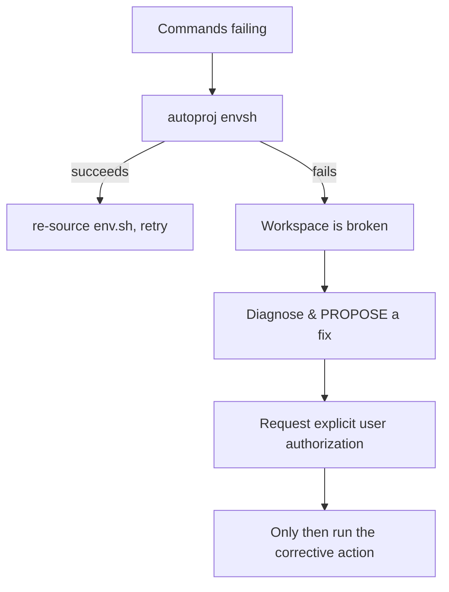

# Troubleshooting Builds & Tests

Work inside the workspace environment (`source env.sh`, or `.autoproj/bin/autoproj
exec -- <cmd>`). Resolve all paths from `.autoproj/installation-manifest`
(`srcdir`, `builddir`, `prefix`, `logdir`), not from guesses or `alocate`.

## Step 1 — Get the real error

Re-run the failing operation in **tool mode** so the underlying tool's output is
not hidden:

```bash
amake --tool <pkg>              # build errors, live
autoproj test --tool <pkg>      # test errors, live
```

For C++ tests where `make test` hides per-test detail, from the package
**build dir**:

```bash
.autoproj/bin/autoproj exec -- make test ARGS=-V
```

## Step 2 — Read the logs

Each package writes per-phase logs under its `logdir` (from the
installation-manifest; typically the prefix's `log/` directory):

```
<logdir>/<pkg>-import.log
<logdir>/<pkg>-prepare.log
<logdir>/<pkg>-build.log
<logdir>/<pkg>-install.log
<logdir>/<pkg>-test.log
```

A log includes the exact command, the environment dump, and mixed stdout/stderr —
ideal for pinpointing a failing compile or link step.

Machine-readable summaries are written under the install dir's `log/`:

- `build_report.json` — per-package build status/errors.
- `import_report.json` — per-package import status.

## Step 3 — Rebuild deliberately

```bash
amake --tool <pkg>              # incremental, see output
amake --rebuild --tool <pkg>    # clean + rebuild from scratch
autoproj clean <pkg>            # drop build byproducts, then amake
```

If a source change is not being picked up, suspect mtime-based change detection —
modifying a source file should make it newer than the build stamp.

## Step 4 — Environment / workspace health check

If commands behave strangely or basic operations fail (not just one package),
run the health check:

```bash
autoproj envsh
```

This reloads the workspace and regenerates `env.sh`.



**If `autoproj envsh` itself fails, the workspace is broken.** You may investigate
and *suggest* remedies (e.g. `autoproj reconfigure`, re-running `osdeps`,
reinstalling gems, fixing `autoproj/` config), but you **MUST request explicit
user authorization before running any corrective or destructive action**. Never
delete `.autoproj/` state, re-bootstrap, or modify workspace config unprompted.

## Missing dependency under `separate_prefixes` (find_package / import failures)

A dependency's prefix is injected into a package's build/run environment only if
that dependency is **declared in the package's `manifest.xml` / `package.xml`**
(autoproj reads those to build the autobuild dependency graph, which drives the
per-package env). When `separate_prefixes` is **disabled** every package installs
into one shared prefix, so an undeclared dependency still resolves *by accident*.
When `separate_prefixes` is **enabled** (each package has its own prefix), an
undeclared dependency's prefix is **never added**, and the build/run breaks:

- C++: `find_package(<dep>)` fails, or headers/libraries from the dependency are not found.
- Python: `import <dep>` fails at runtime/test time.

**Diagnosis & fix:**
1. Confirm the symptom matches (a known workspace dependency isn't visible even
   though it is built).
2. Check whether `separate_prefixes` is enabled (`.autoproj/config.yml`).
3. Open the failing package's `manifest.xml` / `package.xml` and check whether the
   missing dependency is listed as a `<depend>` (or `<build_depend>` /
   `<exec_depend>` for ROS `package.xml`). The manifest is in the package source
   tree, or — for some third-party packages — in the owning package set under
   `manifests/<package_name>.xml` (see the config-files reference).
4. If it is **missing**, do **not** add it silently. **ASK the user** whether they
   want the dependency declared in the package's manifest; only add it on their
   confirmation, then rebuild (`amake --tool <pkg>`).

## Common causes checklist

- Command run **outside** the env → tools/libraries missing. Fix: source env or use `autoproj exec`.
- A **dependency** isn't built → `amake <pkg>` (without `-n`) to build deps first.
- `autoproj test` gives **no output (exit 0)** → tests are **disabled/unavailable**, not passing. `autoproj test list <pkg>`; if disabled, `autoproj test enable <pkg>` → `amake --tool <pkg>` → run. If `Available` stays false, there is no test suite.
- A dependency **isn't declared** in the package's `manifest.xml`/`package.xml` and `separate_prefixes` is on → its prefix is not injected; check the manifest and **ASK** before adding (see above).
- Stale CMake cache after changing options → `amake --rebuild <pkg>`.
- Editing generated files (build/install/`.autoproj`/`env.sh`) → changes lost; edit source instead.
- Interactive prompt stalling automation → add `--no-interactive`.
- Trying to build a **metapackage** as if it had artifacts → build its members instead.

## Consulting the autoproj / autobuild source (authoritative reference)

autoproj and autobuild are Ruby. When you need to understand *exact* behavior — an
obscure error message, what a config key really does, how paths/env are computed,
why a command behaves a certain way — reading their source is the authoritative
answer, more reliable than guessing. Useful for deep troubleshooting and for
answering "how does autoproj do X?" questions.

**The running source is not in the workspace `src/` and its location varies** by
how the gem was installed (a `path:`, `git:`, or rubygems gem — see
`.autoproj/Gemfile`; git/rubygems gems live under `GEM_HOME`/`GEM_PATH` from
`.autoproj/env.*`, e.g. `…/bundler/gems/autobuild-<sha>`).

### Locating the source — fallback ladder

The primary method needs a working environment, which is exactly what may be
broken during troubleshooting. Try these in order and stop at the first that works:

1. **Inside the env (preferred — resolves the actually-loaded version):**
   ```bash
   .autoproj/bin/autoproj exec ruby -e 'puts Gem.loaded_specs["autoproj"].full_gem_path'
   .autoproj/bin/autoproj exec ruby -e 'puts Gem.loaded_specs["autobuild"].full_gem_path'
   ```
2. **If `autoproj exec` fails but bundler still works:**
   ```bash
   .autoproj/bin/bundle show autoproj
   .autoproj/bin/bundle show autobuild
   ```
3. **If bundler also fails — read `.autoproj/Gemfile.lock`** (static, no execution).
   Find the gem's version and the section it's under, which tells you the source
   and where the code lives (cross-check `.autoproj/Gemfile` for the source type):
   - **`PATH`** → `remote:` is a local directory; that path *is* the gem source.
   - **`GIT`** → `remote:` (URL) + `revision:` (sha); the checkout is under
     `<GEM_HOME>/bundler/gems/<gem>-<short-sha>`.
   - **`GEM`** (rubygems) → installed at `<GEM_HOME>/gems/<gem>-<version>`.

   `GEM_HOME`/`GEM_PATH` are defined in `.autoproj/env.sh` / `.autoproj/env.yml`.
4. **Last resort — read `RUBYLIB` in `.autoproj/env.yml`** (a list of `…/<gem>/lib`
   paths, e.g. `…/bundler/gems/autobuild-<sha>/lib`); strip the trailing `/lib` to
   get the gem root. (`env.sh` *unsets* `RUBYLIB` and rebuilds it, so the readable
   list lives in `env.yml`.)

Then read the code under the resolved path (e.g. `lib/autoproj/…`, `lib/autobuild/…`).

- **Prefer the resolved running version**, not an unrelated clone elsewhere in the
  workspace — behavior differs across autoproj/autobuild versions.
- **These methods can disagree in a broken / mid-update workspace** — e.g.
  `Gemfile.lock` (and `bundle show`) point to a newly locked revision while
  `env.yml`/`Gem.loaded_specs` still reflect the *previously generated* env. That
  mismatch is itself a useful signal; `autoproj envsh` reconciles them. Bundler
  reflects what *would* load; `env.*` reflects what the *current* env actually loads.
- Treat this source as **read-only reference** (it is installed gem code; do not edit it).
